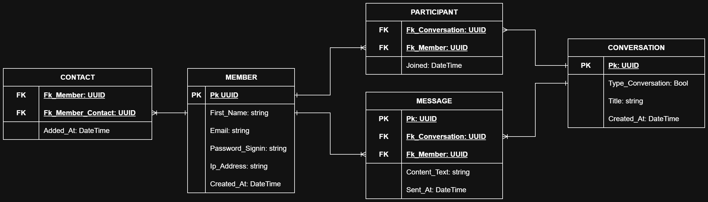

## Features

- Creating group-type conversations;
- Updated messages in real time;

## Technologies/Libraries/Environment

General:

- Ubuntu | 22.04.3 LTS
- [Visual Studio Code | 1.103.2](https://code.visualstudio.com/)
- [Insomnia | 11.0.2](https://insomnia.rest/)
- NPM | 10.8.2
- Docker | 26.0.2
- Docker Compose | 2.26.1
- Git | 2.34.1

Front-end (Web application):

- ReactJS
- TypeScript
- Websocket | Socket.IO

Back-end (API):

- [Node.JS](https://nodejs.org/en)
- Express
- Websocket | Socket.IO
- PG (PostgreSql Connection)

Database:

- PostgreSql | 13

Splunk:

- Splunk | 9.1

## Architecture

  

## Database

  

## How to run

## Improvements

- add tests;
- add functionality `forgot password?`;
- add functionality to change account photo;
- add message delete functionality;
- add functionality to leave group conversations;
- add functionality to add other contacts in a group conversation;
- add functionality to change the title of a group conversation;
- add the ability to view all members of a group-type conversation;
- change the style of a message if the member has not yet entered the conversation to read it;
- add MFA;

## License

This project is under the MIT license. See the [LICENSE](LICENSE.md) file for more details.